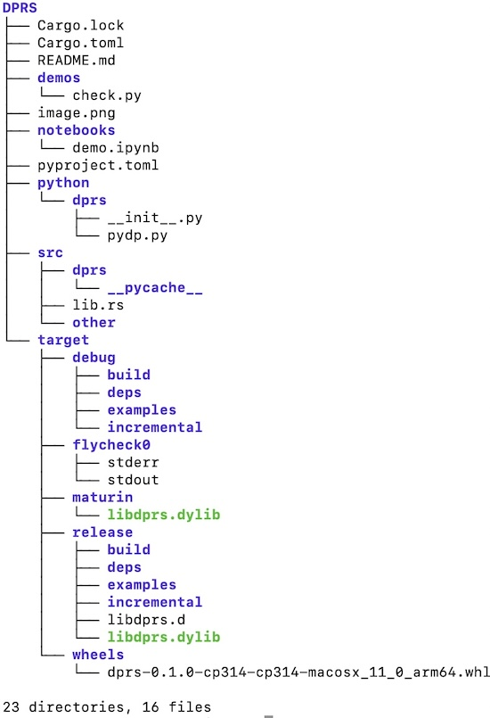

# Integration of Rust and Python

Here are some notes on setting up a Python package wrapped around some Rust code that runs a version of Conway's "Game of Life" using `Rayon` for parallelization ([adapted from here](https://github.com/rayon-rs/rayon/tree/main/rayon-demo/src/life)).

Create a mixed Rust-Python project:

    maturin new dprs -b pyo3

and then, if you want, rename the folder `dprs/`, to e.g. `DPRS/` (which will become your GitHub repo name). 

Enter this directory, `cd DPRS/`.

Set up the Python virtual environment using `uv`:

    uv venv --python=3.14
    source .venv/bin/activate
    uv pip install maturin ipython numpy

Set up a minimal Python package:

    mkdir -p python/dprs
    touch python/dprs/__init__.py

Add requisite Rust packages, e.g.,
    
    cargo add rayon rand

Check `Cargo.toml`  to ensure these crate dependencies have been added (see [https://www.maturin.rs/tutorial.html]()):

    [dependencies]
    pyo3 = "0.27.0"
    rand = "0.10.0"
    rayon = "1.11.0"

Implement `src/lib.rs`. The Python module can follow this naming pattern:

    #[pymodule]
    mod sim {
        use super::*;
        #[pyfunction]
        fn dp(x: usize, y: usize, n: usize) -> PyResult<String> {
            println!("{x} {y} {n}");
            run(x, y, n);
            Ok("Done".to_string())
        }
        #[pyfunction]
        fn pcp(x: usize, y: usize, n: usize) -> PyResult<String> {
            println!("{x} {y} {n}");
            run(x, y, n);
            Ok("Done".to_string())
        }
    }

For this to build correctly, mod `pyproject.toml` like this:

    [tool.maturin]
    python-source = "python"
    module-name = "dprs.sim"

Add `<path>/DPRS/python` to VS Code's extra paths for Pylance.

Compile the Rust and build a Python binary:

    maturin develop --release

which writes to e.g. `<path>/DPRS/.venv/lib/python3.14/site-packages/dprs/dprs.cpython-314-darwin.so`.

Build a Python wheel:

    maturin build --release

which writes to e.g. `<path>/DPRS/target/wheels/dprs-0.1.0-cp314-cp314-macosx_11_0_arm64.whl` as well as creating `dylib` file in 'target/maturin' etc.

Then install the Python wheel into the local venv using `uv pip`:

    uv pip install target/wheels/*.whl 

Create a Python demo script, and maybe also a Jupyter notebook to match, e.g.,:

    mkdir demos
    touch demos/check.py

Put at least the following into `demo.py`:

    from dprs import sim
    print(sim)

    n_x = 1_000
    n_y = n_x
    n_iterations = 200

    sim.dp(n_x, n_y, n_iterations)

The `DPRS` folder tree should now look like this:

