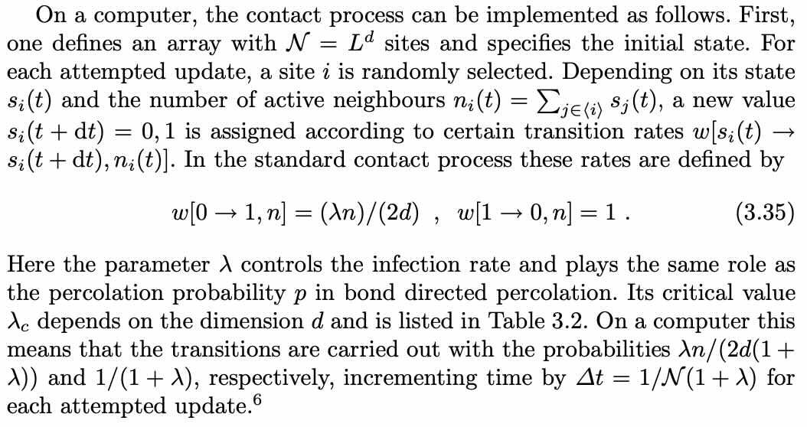
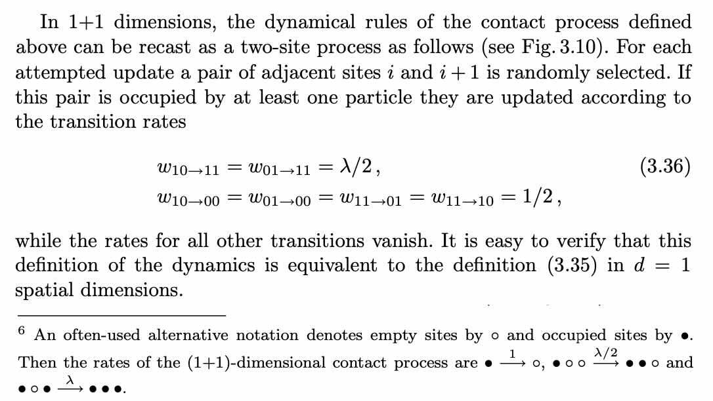
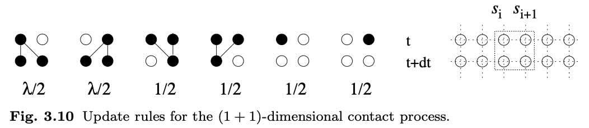

# Contact Process

### CP in $d$ dimensions, according to Henkel et al (2008), is:

<!-- 
 -->

Note that a site neighborhood here is strictly limited to the _nearest_ neighbors, so there are 2 in 1d, 4 in 2d, 6 in 3d, etc: hence the $2d$ factor.

 <!-- - Make a list $\mathcal{S}_{\mathsf{lattice}}$ of *all* the lattice sites, not just the occupied ones -->
 <!-- - Randomize the order of this list: $\rightarrow{\mathcal{S}_{\mathsf{randomized}}}$ -->
<!-- - Reinsert the site $i$ at a _random_ location in the list $\mathcal{S}_{\mathsf{randomized}}$ -->
<!-- - Remove this site $i$ from the list $\mathcal{S}_\mathsf{randomized}$ -->

### The algorithm is roughly:
 - Zero the iteration counter: $\text{ } k=0$ 
 - Construct a $d$-dimensional lattice $\mathcal{L}$ of size $L$ along each axis 
 - Compute the total number of sites: $\text{ } N = L^d$
 - Choose an initial site occupancy probability $p_{0}$
 - Randomize the occupancy of all lattice sites $\{s_i\} \in \mathcal{L}$ such that, for each $i$,  $s_i = \mathsf{Bern}(p_0)$
 - Set a reporting interval $\Delta{t}_{\mathsf{report}}$
 - Create an empty list $\mathcal{L}_{\mathsf{report}}$ to record the lattice after a sequence of changes over this interval
 - Create an empty list $\mathcal{T}_{\mathsf{report}}$ to record the report times 
 - Zero the timer:  $\text{ } t = 0$
 - Zero the report interval timer:  $\text{ } t_\mathsf{report} = 0$
 - Loop over $K$ iterations $k \in \{1, \dots, K\}$:
   - Pick a site at random from the lattice, labeling its position as $i$ and its occupancy as $s_i$
   - Find its neighborhood and label the sites $j \in \langle i \rangle$ with occupancy $s_j$
   - Count the number of occupied sites in the neighborhood: $\text{ } n_i = \sum_{j\in \langle i \rangle} s_j$
   - Note the _propagation_ rate: $\text{ } w_i[0 \mapsto 1, n_i] = \lambda n_i/2 d$
   - Note the _annihilation_ rate: $\text{ } w_i[1 \mapsto 0, n_i] =1$
   - Check $s_i$
     - for an occupied site $s_i\text{==}1$:
         - compute the _annihilation probability_: $\text{ } p_\mathsf{a} = \dfrac{w_i[1 \mapsto 0, n_i]}{1+\lambda} = \dfrac{1}{(1+\lambda)}$
        - compute a Bernoulli sample $b_\mathsf{a} = \mathsf{Bern}(p_\mathsf{a})$
        - if $b_\mathsf{a}\text{==}\mathsf{true}$:
           - designate the site as now empty $s_i \mapsto 0$
           - modify (in-place) the current lattice accordingly $\mathcal{L} \rightarrow \mathcal{L}(t)$
     - for an empty site $s_i\text{==}0$ with _some_ occupied neighbors $n_i \neq 0$:
         - compute the _propagation probability_: $\text{ } p_\mathsf{p} = \dfrac{w_i[0 \mapsto 1, n_i]}{1+\lambda} = \dfrac{\lambda n_i}{2d(1+\lambda)}$
         -  compute a Bernoulli sample $b_\mathsf{p} = \mathsf{Bern}(p_\mathsf{p})$
         - if $b_\mathsf{p}\text{==}\mathsf{true}$:
            - designate the site as now occupied $s_i \mapsto 1$
            - modify (in-place) the current lattice accordingly $\mathcal{L} \rightarrow \mathcal{L}(t)$
     - for an empty site $s_i\text{==}0$ with _no_ occupied neighbors  $n_i = 0$:
         - do nothing
   - Compute the time interval: $\text{ } \Delta{t} = \dfrac{1}{(1+\lambda)N}$
   - Update the timer: $\text{ } t \mapsto t + \Delta{t}$
        - note: the timer is incremented even if nothing happens
   - Update the report timer: $\text{ } t_\mathsf{report} \mapsto t_\mathsf{report} + \Delta{t}$
    - Check it's time to report, $t_\mathsf{report} \geq \Delta{}t_\mathsf{report}$; if so:
        - append the updated (or not) lattice $\mathcal{L}$ to the report list: $\rightarrow \mathcal{L}_\mathsf{report} + \mathcal{L}$
        - append the current time $t$ to the report time list: $\rightarrow \mathcal{T}_{\mathsf{report}} + t$
        - reset the report interval timer $t_\mathsf{report} \mapsto 0$
- Return the list of lattices $\mathcal{L}_{\mathsf{report}}$ 
- Return the report-times list $\mathcal{T}_{\mathsf{report}}$