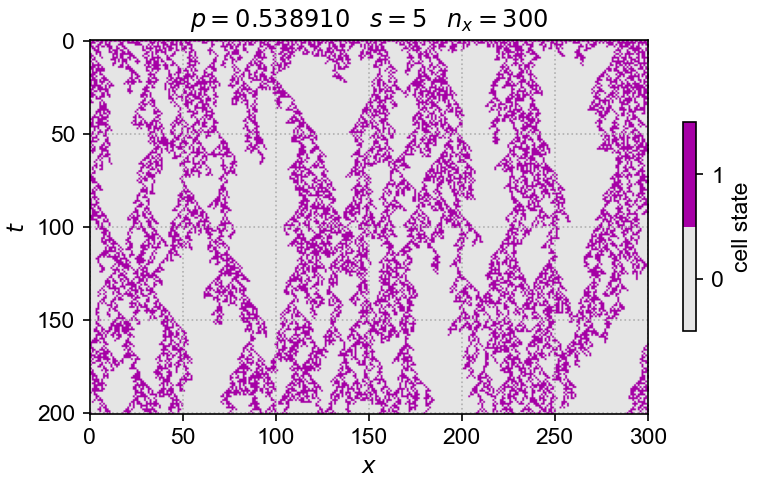

# [**Directed percolation solver in Rust/Python**](https://pypi.org/project/dprs/)

{width=600}

##  DPRS

DPRS implements solvers for a variety of directed-percolation class models. The code is largely written in Rust.
The [solver](https://github.com/cstarkjp/DPRS/tree/main/dprs_core/src) is accessed via a [wrapper](https://github.com/cstarkjp/DPRS/tree/main/py_dprs/src) that exposes it to Python. This wrapping makes experimentation more convenient. 

The Python wrapper is available as a [PyPI package called DPRS](https://pypi.org/project/dprs/) and can be installed using `pip`. It has multi-platform support.
Jupyter notebooks are used to implement the Python-wrapped simulations. 

## Live demos

You can experiment with [interactive demos of the DP solver here.](live-demos/index.md)
These demos run the same Rust code as the Python-wrapped solver, but instead are made available using WebAssembly and accessed via a Typescript/Javascript wrapper.

## Technical motivation

We have two motivations for adopting Rust: one is to ensure maximum performance; another is to achieve this in a memory-safe and bug-free fashion (which is not easy to do in C or C++). 
Fast run times are achieved through parallelization using the [`Rayon` crate](https://docs.rs/rayon/latest/rayon/). 
We anticipate boosting performance further with GPU-compute using [`wgpu`](https://wgpu.rs/).

<!-- See [here](demos-reference.md) for some demos.

See [here](HOWTO.md) for some rough "how-to" notes on wrapping Rust with Python. -->
