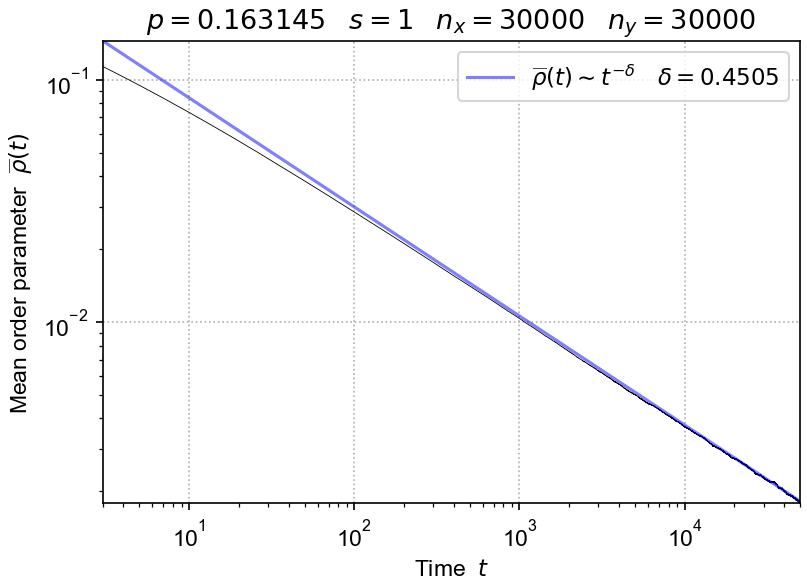

# Python demos

Simplified DP-class Domany-Kinzel model simulations are demonstrated in the Python scripts below.

{width=500}

Quick tests to check all is working:

- [dp_test_1d.py](https://github.com/cstarkjp/DPRS/tree/main/demos/dp_test_1d.py)

- [dp_test_2d.py](https://github.com/cstarkjp/DPRS/tree/main/demos/dp_test_2d.py)

- [dp_test_3d.py](https://github.com/cstarkjp/DPRS/tree/main/demos/dp_test_3d.py)

More substantial simulations:

- [dp_fullcheck_1d.py](https://github.com/cstarkjp/DPRS/tree/main/demos/dp_fullcheck_1d.py)

- [dp_fullcheck_2d.py](https://github.com/cstarkjp/DPRS/tree/main/demos/dp_fullcheck_2d.py)

- [dp_fullcheck_3d.py](https://github.com/cstarkjp/DPRS/tree/main/demos/dp_fullcheck_3d.py)
