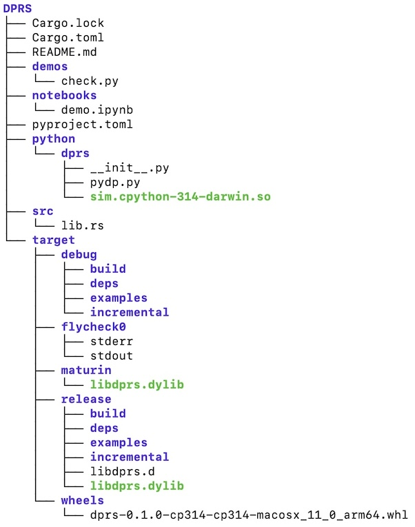

# Wrapping Rust in Python

Here are some notes on how to wrap a Python package around fast, parallelized Rust code. 

## Rust-Python project

Create a mixed Rust-Python project:

    maturin new dprs -b pyo3

and then, if you want, rename the directory `dprs/`, to e.g. `DPRS/`. In principle, this will become the name of your `pip` package.
Enter this directory, `cd DPRS/`.

## Virtual env

Create a Python virtual environment using `uv`, activate it, and install whatever Python libraries are going to be needed:

    uv venv --python=3.14
    source .venv/bin/activate
    uv pip install maturin ipython numpy

## Initialize Python package

Set up the minimal elements of a Python package:

    mkdir -p python/dprs
    touch python/dprs/__init__.py

Add `<path>/DPRS/python` to VSCode's extra paths for Pylance, if you're using it.

## Set up Rust

Add the requisite Rust packages, e.g.,
    
    cargo add rayon rand

Check `Cargo.toml`  to ensure that these crate dependencies have been added (see [https://www.maturin.rs/tutorial.html]()):

    [dependencies]
    pyo3 = "0.27.0"
    rand = "0.10.0"
    rayon = "1.11.0"

## Implement the Rust library

Implement `src/lib.rs`. The Python module can follow this naming pattern:

    #[pymodule]
    mod sim {
        use super::*;
        #[pyfunction]
        fn dp(x: usize, y: usize, n: usize) -> PyResult<String> {
            println!("{x} {y} {n}");
            run(x, y, n);
            Ok("Done".to_string())
        }
    }

For this to build correctly, mod `pyproject.toml` like this:

    [tool.maturin]
    python-source = "python"
    module-name = "dprs.sim"

## Build the libraries

Compile the Rust and build a Python binary:

    maturin develop --release

which writes to e.g. `<path>/DPRS/.venv/lib/python3.14/site-packages/dprs/dprs.cpython-314-darwin.so`.

Build a Python wheel:

    maturin build --release

which writes to e.g. `<path>/DPRS/target/wheels/dprs-0.1.0-cp314-cp314-macosx_11_0_arm64.whl` as well as creating `dylib` file in 'target/maturin' etc.

## Install the Python library locally

Then install the Python wheel into the local venv using `uv pip`:

    uv pip install target/wheels/*.whl 

## Test with a demo script

Create a Python demo script, and maybe also a Jupyter notebook to match, e.g.,:

    mkdir demos
    touch demos/check.py

Put at least the following into `demo.py`:

    from dprs import sim
    print(sim)

    n_x = 1_000
    n_y = n_x
    n_iterations = 200

    sim.dk(n_x, n_y, n_iterations)

## How it should look

The `DPRS` folder tree should now look like this, more or less:

